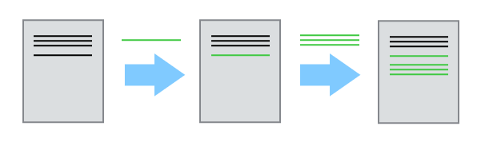
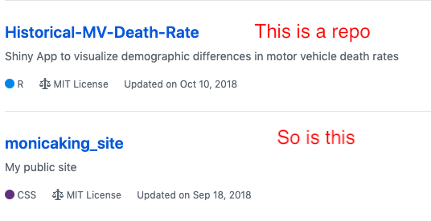
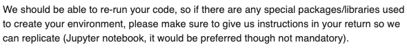
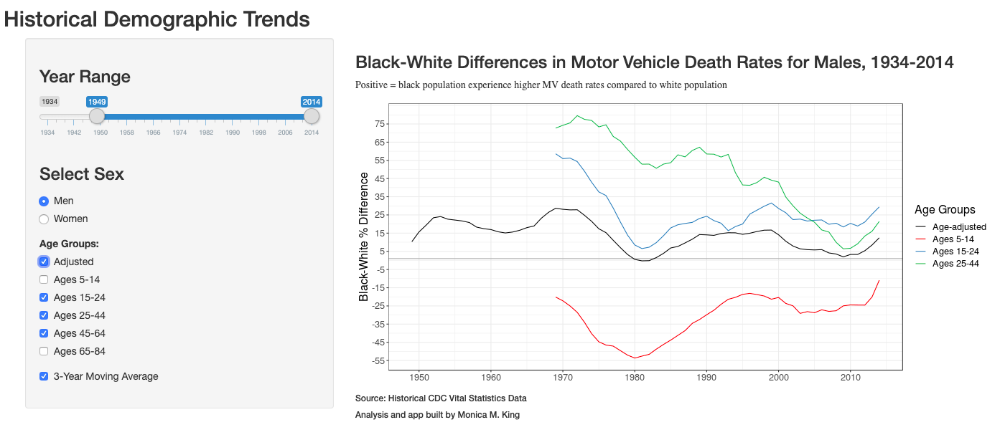
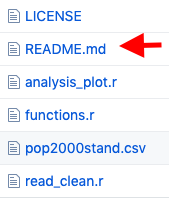
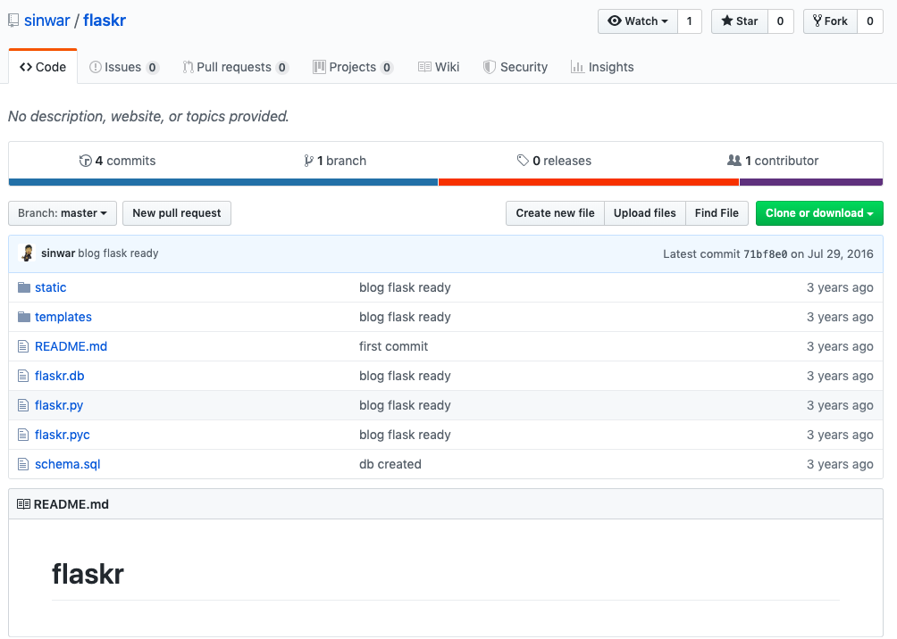
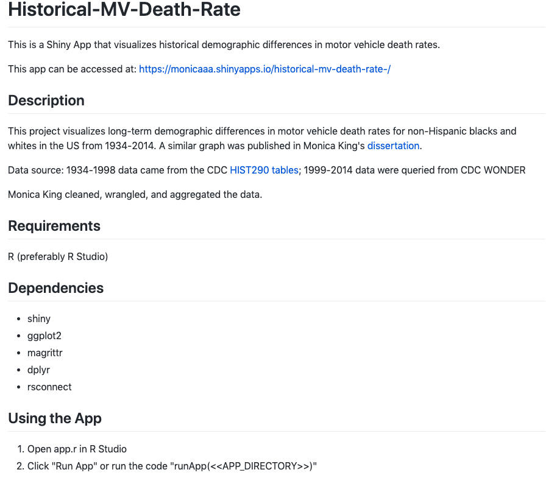

```{r setup, include=FALSE}
knitr::opts_chunk$set(echo = FALSE)
```

## What is git?

--

**Git** is a version control system that tracks and archives changes to your file (code)

```{r echo=FALSE, out.width="600px", fig.align="center"}

```

Source: https://swcarpentry.github.io/git-novice/

--

Advantages of using git:

--

 - All versions of code are saved, allowing you to go back in time and use an older version
 
--

 - Prevents you from overwriting other people's changes when you're collaborating together

---

## What is Github? 

--

**Github** is a service that hosts projects (called repositories or "repos") using git

--

```{r echo=FALSE, out.width="300px", fig.align="center"}

```

--

Advantages of using Github as your portfolio:

--

 - It's very popular
 
--

 - It's free (for most uses)
 
--

 - It's accessible -- public repos allow anyone (hiring managers!) to see your project and its history
 
--

*Ideally you should use Github from the beginning, but you can also put up existing code after a project has started or completed
*
---

## Misconceptions of using Github to build your portfolio

--

**Myth #1:** I should use GitHub to demonstrate that I know really fancy stuff

--

**Reality:** 

--
- Not all data science problems require fancy solutions

--

- Even those that do require fancy stuff begin with data exploration and descriptive analysis

--

- Hiring managers sometimes just want to make sure you meet basic requirements

--
 - “I looked at your Github and you seem to know what you’re doing” - Interviewer

---
## Misconceptions of using Github to build your portfolio (continued)

--

**Myth #2:** I can plop my code in a Github repo and call it a day.

--

**Reality:** 

--

- Hiring managers want to make sure you care about writing code that is reproducible and readable ("Opinionated analysis development" by Hilary Parker, 2017)

--

- Those are signs that you can thrive in a collaborative environment

--

- Interviewer's email instructions on technical assessment: 
```{r echo=FALSE, out.width="700px", fig.align="center"}

```

---

## What skills can you demonstrate with Github?
--

In addition to coding...
- Ability to translate a (business) problem/question into a data science problem

--

 - I did this by describing my PhD work in simple and relevant terms

--

- Curiousity and willingness to learn

--

 - I did this by recreating a figure from my PhD research in Shiny as a proof of concept

---

## Example: My simple Shiny app

```{r echo=FALSE, out.width="700px", fig.align="center"}

```

---
## What skills can you demonstrate with Github?

In addition to coding...

- Ability to translate a (business) problem/question into a data science problem

 - I did this by describing my PhD work in simple and relevant terms

- Curiousity and willingness to learn

 - I did this by recreating a figure from my PhD research in Shiny as a proof of concept

--

- Signs that you can work with people

--

 - I did this by making sure my code was well-documented and readable to someone seeing it for the first time

---

## Tips on using Github to showcase your data science skills

--

Tip 1: Pick small, simple self-contained projects over “more impressive,” disjointed ones

--

 - At a minimum, it should run and produce some output
 
--

 - Instead of the entire dissertation, I put up code and analysis from a slice of my dissertation and make sure it worked

--

 - Quality over quantity!
 
---

## Tips on using Github to showcase your data science skills

--

Tip 2: Write a comprehensive README file

--

```{r echo=FALSE, out.width="100px", fig.align="center"}

```

--
 - Include sections on project description, dependencies (data, environment, libraries/packages), instructions on how to install/run code

--

 - Wisdom from a conference: "If a new person were to use your repo for the first time, how many questions would they need to ask you?" Get this down to zero.
 
---

## Example of a project without a README

--

```{r echo=FALSE, out.width="580px", fig.align="center"}

```

source: "A Beginners Guide to writing a Kickass README" by Akash Nimare: https://medium.com/@meakaakka/a-beginners-guide-to-writing-a-kickass-readme-7ac01da88ab3
---

## Example of the README for my Shiny app

--

```{r echo=FALSE, out.width="580px", fig.align="center"}

```

---

## Tips on using Github to showcase your data science skills

--

Tip 3: Clean up your code and organize your files 

--

 - use a code linter (e.g. *styler* package in R)

--

 - follow standard code style guide (e.g. tidyverse style guide for R)
 
--

 - make your code readable and workflow as intuitive as possible 

--

Tiffany Timbers has a good presentation on data science workflows: "When should you add Github, Make and Docker to your data science workflow?"

---

layout: false
class: inverse, middle, center

# Thank you! 
## Monica King
## himonicaking@gmail.com
